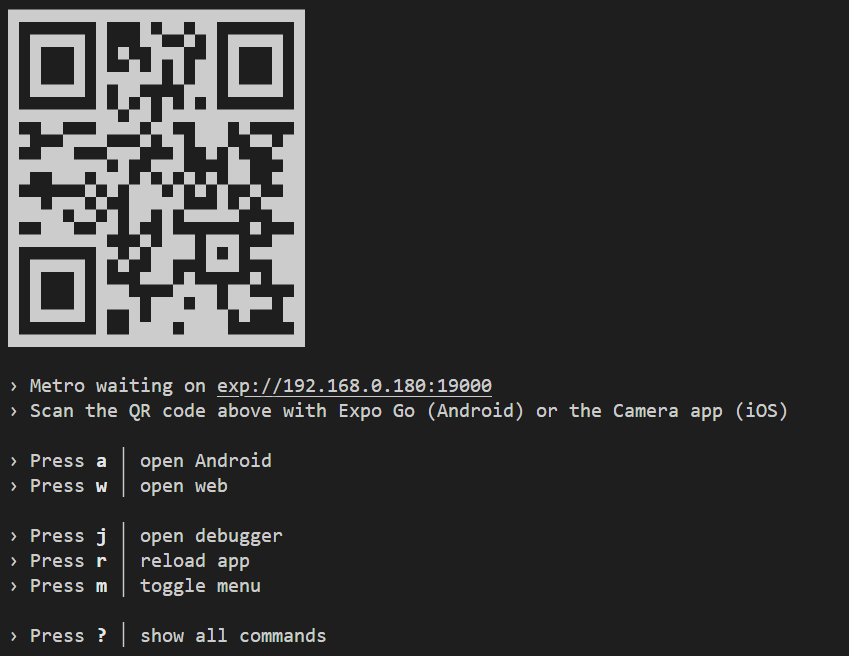
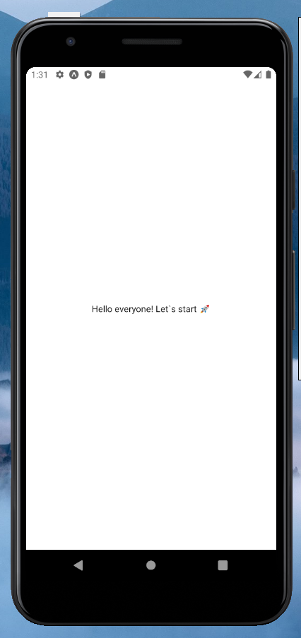

# goit-react-native-hw

How to launch the project?

1. Write the command npm start in the console
2. The project will start at http://localhost:19000 and in the console will offer to choose one of the launch options:

3. Choose option and app will launch on device:

